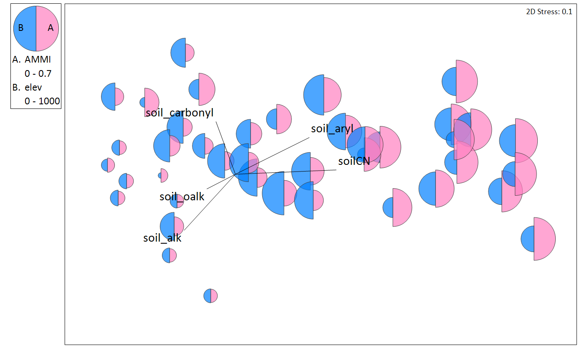
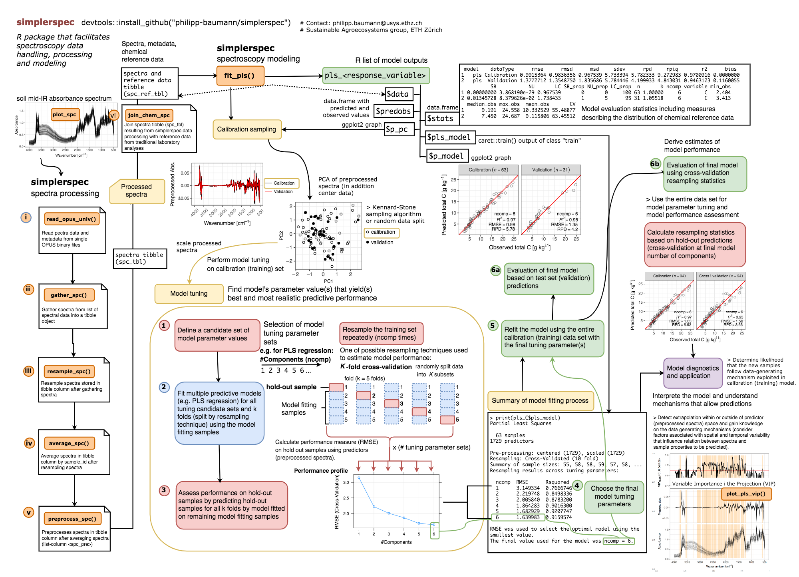

# AFDS Synthesis Project
###### (aka "_the best of good intentions_")

## Background
### Old Mark

I'm a small data biogeochemist. My main tools today have been:

* Data wrangle in Excel (urgh)
* Visualise in SigmaPlot (surprisingly good, until it crashes)
* Analyse on an ancient university laptop with an equally ancient version of SPSS (very urgh)
* Spectral analysis (e.g. MIR) reliant on expensive proprietory software requiring external expertise and vulnerable to change
* Molecular data increasingly important, but always an SEP (someone else's problem)
* Multivariate stats in [Primer-E](https://www.primer-e.com/our-software/primer-version-7/?currency=NZD) and [PERMANOVA+](http://www.primer-e.com/our-software/permanova-add-on/?currency=NZD) (surprisingly powerful and robust, only "urgh" is repeatability... and partially shoddy graphics)
...
* Be generally collegial in my both effort/data attribution, and try to leave data in a reasonable shape once a project is complete, but with no real thought on formal onward use by external parties

### New Mark ....or where new Mark needs to be

* Wrangle data of all shapes and sizes, repeatably, and with clear workflows for provenance
* Visualise data cleanly, often displaying many factors on the same figure, e.g. 
...
* Use clear, transparent and appropriate modern statistical techniques (e.g. properly designed mixed models tests) that are repeatable and portable between platforms (and not just 15 year old laptops running Windows XP)
* Be able to work with others to develop workflows for spectral data that follow both traditional (PLS-R) approaches, and more modern ML techniques such as random forests and neural networks. This is particularly important given current reliance on expensive proprietory software with a trejectory of declining users. Some examples include `soil.spec`, an [R package from ICRAF](https://cran.r-project.org/web/packages/soil.spec/soil.spec.pdf) and what [looks to be a very promising envionment within R](https://cran.r-project.org/web/packages/prospectr/vignettes/prospectr-intro.pdf), `prospectR`. Both of these packages / environments look to provide good in-roads at least in the pre-processing stages, even if eventually as a group we move away from PLS-R to more modern ML techniques. Another potential R package, again at least for more basic processing of spectral data looks to be `simplerspec` which is still in development, but downloadable via `devtools` from [github](https://github.com/philipp-baumann/simplerspec). This seems to fully integrate with the `tidyverse` with regard to tibbles etc. The 'cheat sheet' looks like a sensible way forward
...
* Be proficent in the processing of my own molecular data. This must include both extraction and visualisation of metadata for the purposes of QA/QC. Rather than relying on an external service provider (e.g. [AGRF](http://www.agrf.org.au/)) to do broad-brush bioinformatics for me, or cadging favours from collaborators, I need to be able to apply the same scrutiny to this data as I would any directly generated in our own lab. Further, I need to be clear of the rationale taken at many of the steps (e.g. cut-offs for quality, OTU identification, etc)
* Despite the powerful nature of Primer-E, and the perhaps unique factor that many of the multivariate statistical routines
* Have clear plans in place about where data will come from, what will happen to it, where it will go, how it can be used beyond the life of the project, and agreement over who should be attributed for what

